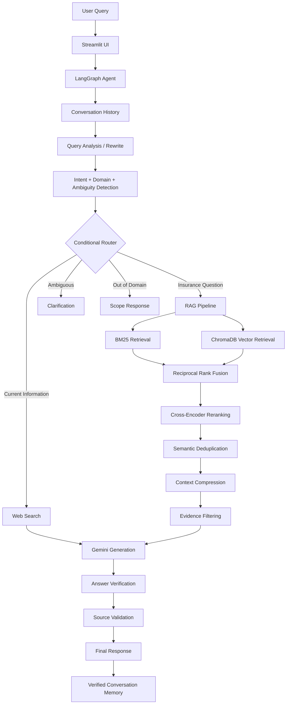

# 🛡️ Agentic Insurance Support Chatbot

> An evaluation-driven **Agentic RAG system** for document-grounded insurance question answering, built with **LangGraph, LangChain, Gemini, ChromaDB, BM25, Hugging Face, LangSmith, and Langfuse**.

The system goes beyond a standard retrieve-and-generate chatbot. It analyzes each query, maintains conversational context, dynamically routes between document retrieval, web search, clarification, and out-of-domain handling, and verifies generated answers against retrieved evidence before returning them.

---

## ✨ Highlights

- 🧠 **Agentic LangGraph workflow** with conditional routing
- 🔎 **Hybrid RAG** combining BM25 and dense vector retrieval
- 🔀 **Reciprocal Rank Fusion (RRF)** for retrieval fusion
- 🎯 **Cross-encoder reranking** for higher-precision context selection
- ✂️ **Context compression & semantic deduplication**
- 💬 **Session-isolated conversational memory**
- 🌐 **Web search fallback** for current insurance information
- 🛡️ **Answer verification & hallucination mitigation**
- 📚 **Validated source attribution** with document/page provenance
- 📊 **45-case evaluation benchmark**
- 🔭 **LangSmith + Langfuse observability**
- ⚖️ **LLM-as-a-Judge evaluation**
- 🧪 **46 offline tests + GitHub CI**

---

## 🏗️ Architecture



---

## 🧠 How It Works

### 1. Document Knowledge Base

Insurance documents are processed through an ingestion pipeline:

```text
PDF / TXT / DOCX
        ↓
Text Extraction
        ↓
Chunking + Metadata
        ↓
Hugging Face Embeddings
        ↓
ChromaDB
```

The system uses:

**`BAAI/bge-small-en-v1.5`**

for dense semantic embeddings.

Source filename and page metadata are preserved so generated answers can be traced back to the underlying documents.

---

### 2. Hybrid Retrieval

Instead of relying only on vector similarity, the system combines two retrieval strategies.

**BM25** provides lexical retrieval and performs well for exact insurance terminology.

**ChromaDB vector search** provides semantic retrieval and handles differently worded queries with similar meanings.

Results are combined using **Reciprocal Rank Fusion (RRF)**:

```text
BM25 Results ──────┐
                   ├── RRF → Candidate Evidence
Vector Results ────┘
```

This allows the retriever to benefit from both keyword precision and semantic similarity.

---

### 3. Cross-Encoder Reranking

Hybrid retrieval prioritizes recall and produces candidate chunks.

Candidates are then reranked using:

**`cross-encoder/ms-marco-MiniLM-L-6-v2`**

The cross-encoder evaluates the query and each candidate together, producing a stronger relevance ranking before context reaches the LLM.

```text
Hybrid Candidates
        ↓
Cross-Encoder
        ↓
Semantic Deduplication
        ↓
Context Compression
        ↓
Final Evidence
```

---

## 🤖 Agentic LangGraph Workflow

The chatbot uses **LangGraph** to model the application as a stateful workflow rather than a fixed RAG chain.

The agent can choose between four primary routes:

| Route | Purpose |
|---|---|
| **RAG** | Answer using insurance documents |
| **Web Search** | Handle current/live insurance information |
| **Clarification** | Request missing context for ambiguous questions |
| **Out of Domain** | Reject unrelated requests gracefully |

### Example

**User**

> What is Zero Co-pay?

The system retrieves relevant insurance evidence and generates a grounded response.

A follow-up such as:

> Can I buy it separately?

uses conversation history to resolve what **"it"** refers to before retrieval.

A query such as:

> Who is the current IRDAI Chairperson?

can instead be routed to web search because static insurance documents may contain outdated information.

And:

> Can I claim this?

is treated as ambiguous and routed toward clarification rather than forcing an unsupported answer.

---

## 🛡️ Reliability & Hallucination Control

The system uses multiple layers to reduce unsupported responses:

```text
Hybrid Retrieval
      ↓
Reranking
      ↓
Evidence Filtering
      ↓
Grounded Generation
      ↓
Citation Validation
      ↓
Answer Verification
      ↓
Final Response
```

The model generates answers against selected evidence and references evidence IDs rather than freely generating citations.

Source names, pages, and URLs are reconstructed from trusted retrieval metadata.

A separate verification step checks generated claims against the selected evidence. Answers that fail verification fall back rather than being presented as verified information.

> Verification reduces unsupported generation but does not guarantee factual correctness.

---

## 💬 Conversational Memory

Conversation state is owned by the active Streamlit session rather than a shared global history file.

Only verified interactions are retained.

```python
from src.chatbot.langgraph_chatbot import app

first = app.invoke({
    "question": "What is Zero Co-pay?"
})

second = app.invoke({
    "question": "Can I buy it separately?",
    "history": first["history"],
})

print(second["answer"])
```

This allows contextual follow-ups while avoiding accidental history sharing between independent sessions.

---

# 📊 Evaluation Framework

A major part of this project is evaluating the **entire agent**, not just the final generated answer.

The repository contains a curated benchmark of **45 test cases** covering:

- Policy features
- Zero Co-pay
- Claims
- Insurance Ombudsman
- Current/live information
- Ambiguous questions
- Out-of-domain requests

The evaluation pipeline measures both deterministic system behavior and semantic response quality.

---

## Evaluation Metrics

| Metric | What It Evaluates |
|---|---|
| **Answer Correctness** | Semantic agreement with reference answers |
| **Routing Accuracy** | Whether LangGraph selected the expected route |
| **Source Hit** | Whether the expected document was retrieved |
| **Retrieval Relevance** | Quality of retrieved evidence |
| **Groundedness** | Whether generated claims are supported by evidence |
| **Hallucination Signal** | Unsupported-answer behavior |
| **Latency** | End-to-end and node execution time |
| **Error Rate** | Failed agent executions |
| **Token Usage** | Provider-reported LLM usage |
| **Trace Analytics** | Node-level workflow behavior |

Metrics that can be computed deterministically do **not** require an LLM judge.

---

## ⚖️ LLM-as-a-Judge

Open-ended answers cannot always be evaluated using exact string matching.

For example:

```text
Reference:
"The claim must be submitted within 30 days."

Generated:
"You need to submit the claim within thirty days."
```

These answers are semantically equivalent despite having different text.

The optional LLM judge evaluates dimensions such as:

- answer correctness
- groundedness
- retrieval relevance

A single judge call scores the semantic dimensions for each evaluation case to reduce unnecessary API usage.

Judge scores are treated as evaluation signals rather than absolute ground truth.

---

## 🔭 LangSmith & Langfuse

### LangSmith

Optional LangSmith integration provides tracing and experiment management for:

- LangGraph execution
- model calls
- errors
- latency
- token usage
- benchmark experiments

### Langfuse

Optional Langfuse integration provides additional observability for:

- traces
- LLM generations
- latency
- token metadata
- evaluation scores

Both integrations are optional. The chatbot continues to work without observability credentials.

---

# ⚡ LLM Call Efficiency

The workflow avoids calling Gemini when deterministic routing is sufficient.

| Route | Typical Agent Calls |
|---|---:|
| Clear clarification | 0 |
| Clear out-of-domain | 0 |
| Uncertain classification | 1 |
| Normal RAG | 2 |
| Live web answer | 2 + web search |
| History-dependent / uncertain RAG | Up to 3 |
| Evaluation with LLM Judge | +1 per case |

Embedding generation, BM25 retrieval, reranking, RRF, and context compression run locally and do not consume Gemini quota.

---

# 🧪 Testing

The project contains **46 offline tests** covering major components without consuming Gemini or Tavily quota.

External services are mocked where appropriate, while retrieval tests can use temporary Chroma indexes and deterministic embeddings.

```bash
pytest -q
ruff check .
```

Current verified development status:

```text
46 tests passed
Ruff passed
45 evaluation cases validated
GitHub CI: Python 3.11 / 3.12
```

---

# 🚀 Getting Started

## 1. Clone

```bash
git clone https://github.com/turbzox1/insurance-support-chatbot.git
cd insurance-support-chatbot
```

## 2. Create a virtual environment

### Windows PowerShell

```powershell
python -m venv .venv
.\.venv\Scripts\Activate.ps1
```

## 3. Install dependencies

```powershell
python -m pip install -e ".[dev,observability]"
```

## 4. Configure environment

```powershell
Copy-Item .env.example .env
```

Configure the services you want to use:

```env
GOOGLE_API_KEY=
TAVILY_API_KEY=

LANGSMITH_TRACING=false
LANGSMITH_API_KEY=
LANGSMITH_PROJECT=

LANGFUSE_ENABLED=false
LANGFUSE_PUBLIC_KEY=
LANGFUSE_SECRET_KEY=
LANGFUSE_HOST=
```

Never commit `.env`.

---

# 📚 Build the Knowledge Base

Place supported documents inside:

```text
data/
```

Supported formats:

- PDF
- TXT
- DOCX

Then run:

```bash
python -m src.retrieval.ingest
```

The ingestion pipeline:

1. extracts document text,
2. chunks content with overlap,
3. preserves source metadata,
4. creates Hugging Face embeddings,
5. stores vectors in ChromaDB.

Repeated ingestion uses stable chunk IDs to avoid duplicate chunks.

Scanned PDFs require OCR, which is currently outside the project scope.

---

# ▶️ Run the Chatbot

```bash
streamlit run src/app.py
```

The Streamlit application provides the conversational interface and maintains session-specific history.

---

# 📈 Run Evaluation

### Validate the benchmark without API calls

```bash
python -m src.evaluation.evaluation --validate
```

### Small real evaluation

```bash
python -m src.evaluation.evaluation --run --limit 3
```

### Add LLM-as-a-Judge

```bash
python -m src.evaluation.evaluation --run --judge --limit 3
```

### Full evaluation

```bash
python -m src.evaluation.evaluation --run --judge
```

### LangSmith experiment

```bash
python -m src.evaluation.evaluation --run --judge --langsmith --limit 3
```

Real evaluation runs consume Gemini quota, so small runs are recommended before executing the complete benchmark.

Evaluation reports are written to:

```text
evaluation/results/
```

---

# 📁 Project Structure

```text
insurance-support-chatbot/
│
├── data/                       # Insurance knowledge documents
├── evaluation/
│   ├── test_dataset.csv        # 45-case evaluation benchmark
│   └── results/                # Local evaluation reports
│
├── src/
│   ├── app.py                  # Streamlit entry point
│   │
│   ├── chatbot/                # LangGraph agent & routing
│   ├── retrieval/              # Ingestion, BM25, Chroma, RRF,
│   │                           # reranking & compression
│   ├── services/               # LLM/web clients, memory,
│   │                           # tracing & operational metrics
│   ├── evaluation/             # Evaluation runner & judge
│   ├── config/                 # Environment & project settings
│   └── ui/                     # Streamlit interface
│
├── tests/                      # Offline automated tests
├── .github/workflows/ci.yml    # GitHub Actions CI
├── .env.example
├── pyproject.toml
└── README.md
```

---

# 🔧 Technology Stack

### AI / Agentic Systems
`LangGraph` · `LangChain` · `Gemini`

### Retrieval
`ChromaDB` · `BM25` · `Reciprocal Rank Fusion`

### NLP
`BAAI/bge-small-en-v1.5` · `cross-encoder/ms-marco-MiniLM-L-6-v2`

### Application
`Python` · `Streamlit`

### Search
`Tavily`

### Evaluation & Observability
`LangSmith` · `Langfuse` · `LLM-as-a-Judge`

### Engineering
`pytest` · `Ruff` · `GitHub Actions`

---

# 📌 Current Scope

This project is an internship/learning implementation of an evaluation-driven agentic RAG system.

The repository demonstrates:

- document-grounded generation,
- hybrid information retrieval,
- agentic routing,
- conversational context,
- evidence verification,
- source attribution,
- evaluation-driven AI development,
- LLM observability,
- automated testing and CI.

It does **not** claim regulatory compliance, production-grade reliability, calibrated confidence, OCR support, fine-tuning, or independently validated benchmark performance.

The included insurance documents should be treated as reference material rather than universally current insurance advice.

---

## 👨‍💻 Author

**Piyush Patni**

B.Tech — Cyber Physical Systems  
Minor Specialization — Data Science  
Manipal Institute of Technology

Built as part of my **AI Internship at InfoBeans Technologies (May–July 2026)**.
